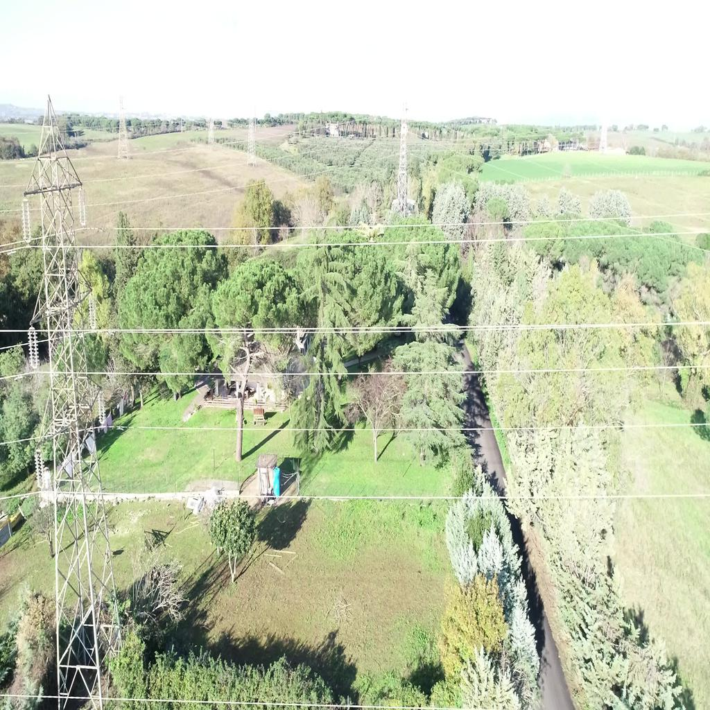
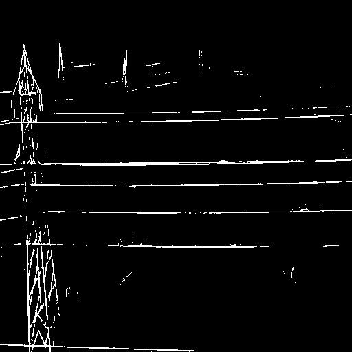

# Deep Learning for Powerline Cable Segmentation

In this work it will be considered powerline cable's detection to guarantee the safe navigation of drones.
Wire's detection has been modelled as an image segmentation task, i.e. a label has been assigned to each pixel of an image in order to highlight objects of interest.
Line and edge detection has been widely addressed with computer vision traditional algorithms like **Canny edge detector**.
However the effectiveness of traditional detectors is strictly influenced by the tuning of multiple parameters, which requires careful engineering; it is thus difficult to achieve good generalization properties.

**Convolutional Neural Networks** have been successfully employed for computer vision tasks since 2012 ImageNet ILSVRC challenge.

A large dataset is needed when dealing with deep learning applications; usually an image segmentation task requires tens of thousands of images.
Collecting such an amount of powerlines images is really expensive; furthermore drawing the ground truth, i.e. the label, for each element in the dataset is even more expensive and time requiring.

A possible solution is the usage of a training dataset generated synthetically with a graphic engine.

The effectiveness of this solution has been inspected in this work, comparing the performances of different CNNs architectures trained on synthetic data :

* Unet: a CNN designed for biomedical tasks, it represents a baseline when dealing with image segmentation problems.
* DilatedVgg: a CNN that has been developed for this work, it exploits transfer learning and dilated convolution operation which allows to aggregate multiscale context information without loosing image's resolution.  

The results on test data have been compared with the state-of-the-art performances.

## Environment and implementation

The deep learning application has been developed using TensorFlow and Keras  within Python language environment.

## Example on real data

Real: 

Prediction:

